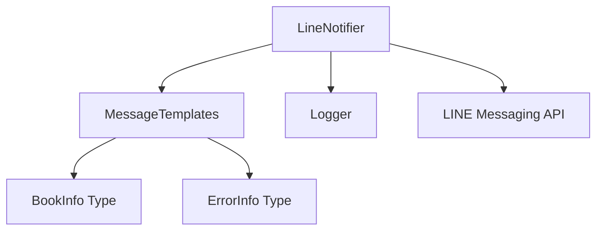

# LINE Notifier 設計同步分析

## 變更概述

LineNotifier.ts 檔案已經實作完成，基於 Context7 查詢的 LINE Bot SDK 最佳實踐。以下是實作與設計規格的同步分析。

## 實作變更分析

### 1. 核心架構變更

**實作狀態**: ✅ 完成
- 使用 `@line/bot-sdk` 的 `messagingApi.MessagingApiClient`
- 遵循官方 SDK 的最佳實踐
- 實作了完整的錯誤處理和重試機制

### 2. 新增功能

#### 2.1 MessageTemplates 整合
**實作狀態**: ✅ 完成
- 整合了 `MessageTemplates` 類別來處理訊息格式化
- 支援 Flex Message 和純文字訊息兩種格式
- 可透過 `setUseFlexMessages()` 方法切換訊息類型

#### 2.2 每日摘要通知
**實作狀態**: ✅ 新增功能
- 新增 `sendDailySummaryNotification()` 方法
- 支援發送每日統計摘要（總書籍數、新書數、下載數、失敗數）
- 使用 Flex Message 格式提供更豐富的視覺效果

#### 2.3 增強的重試機制
**實作狀態**: ✅ 完成
- 實作指數退避延遲 (exponential backoff)
- 可配置的最大重試次數和基礎延遲時間
- 詳細的錯誤日誌記錄

### 3. 訊息類型支援

#### 3.1 支援的訊息格式
- **文字訊息**: 基本的純文字通知
- **Flex 訊息**: 豐富的卡片式訊息格式
- **錯誤通知**: 結構化的錯誤資訊顯示
- **狀態通知**: 系統狀態和統計資訊
- **每日摘要**: 完整的日報格式

## 設計規格同步狀態

### ✅ 已符合設計規格的部分

1. **LINE Messaging API 整合**
   - 使用官方 SDK
   - 正確的 API 客戶端初始化
   - Token 驗證機制

2. **錯誤處理策略**
   - 網路錯誤重試
   - API 錯誤分類處理
   - 結構化錯誤日誌

3. **訊息格式化**
   - 書籍通知格式
   - 錯誤通知模板
   - 狀態通知格式

### 🔄 需要更新設計規格的部分

#### 1. 新增 MessageTemplates 依賴

**設計文件更新需求**:
```javascript
// 需要在設計文件中加入 MessageTemplates 依賴
class LineNotifier {
    // 新增依賴
    private messageTemplates: MessageTemplates;
    
    // 新增方法
    setUseFlexMessages(useFlexMessages: boolean): void
    sendDailySummaryNotification(summary): Promise<boolean>
}
```

#### 2. 擴展介面定義

**當前設計規格**:
```javascript
class LineNotifier {
    async sendBookNotification(bookInfo)
    async sendErrorNotification(error)
    async validateToken()
    formatMessage(bookInfo)
}
```

**實際實作介面**:
```javascript
class LineNotifier {
    // 基本方法
    setUserId(userId: string): void
    setRetryConfig(maxRetries: number, retryDelay: number): void
    setUseFlexMessages(useFlexMessages: boolean): void
    
    // 通知方法
    async sendBookNotification(bookInfo: BookInfo): Promise<boolean>
    async sendErrorNotification(errorInfo: ErrorInfo): Promise<boolean>
    async sendStatusNotification(status: string, details?: any): Promise<boolean>
    async sendDailySummaryNotification(summary): Promise<boolean>
    
    // 驗證方法
    async validateToken(): Promise<boolean>
}
```

#### 3. 新增類型定義需求

需要確保 `src/types/index.ts` 包含以下類型：

```typescript
export interface LineMessage {
  type: 'text' | 'flex';
  text?: string;
  altText?: string;
  contents?: any; // Flex Message contents
}

export interface ErrorInfo {
  code: string;
  message: string;
  timestamp: Date;
  retryCount?: number;
}
```

## 建議的設計文件更新

### 1. 更新 LINE通知模組介面

```javascript
class LineNotifier {
    // 設定方法
    setUserId(userId: string): void
    setRetryConfig(maxRetries: number, retryDelay: number): void
    setUseFlexMessages(useFlexMessages: boolean): void
    
    // 核心通知功能
    async sendBookNotification(bookInfo: BookInfo): Promise<boolean>
    async sendErrorNotification(errorInfo: ErrorInfo): Promise<boolean>
    async sendStatusNotification(status: string, details?: any): Promise<boolean>
    async sendDailySummaryNotification(summary: DailySummary): Promise<boolean>
    
    // 驗證功能
    async validateToken(): Promise<boolean>
}
```

### 2. 新增 MessageTemplates 模組

```javascript
class MessageTemplates {
    static createBookNotificationTextMessage(bookInfo: BookInfo): LineMessage
    static createBookNotificationFlexMessage(bookInfo: BookInfo): LineMessage
    static createErrorNotificationTextMessage(errorInfo: ErrorInfo): LineMessage
    static createErrorNotificationFlexMessage(errorInfo: ErrorInfo): LineMessage
    static createStatusNotificationTextMessage(status: string, details?: any): LineMessage
    static createStatusNotificationFlexMessage(status: string, details?: any): LineMessage
    static createDailySummaryFlexMessage(summary: DailySummary): LineMessage
}
```

### 3. 更新依賴關係圖



## 測試覆蓋需求

基於實作的功能，需要確保以下測試覆蓋：

1. **單元測試**
   - 各種通知方法的成功/失敗情況
   - 重試機制測試
   - Token 驗證測試
   - 訊息格式切換測試

2. **整合測試**
   - 與 MessageTemplates 的整合
   - 與 LINE API 的實際整合
   - 錯誤處理流程測試

## 結論

LineNotifier.ts 的實作已經超越了原始設計規格，加入了更多實用功能：

✅ **已完成且符合規格**:
- 基本 LINE 通知功能
- 錯誤處理和重試機制
- Token 驗證

🆕 **新增功能**:
- Flex Message 支援
- 每日摘要通知
- MessageTemplates 整合
- 更靈活的配置選項

📝 **需要更新設計文件**:
- 更新介面定義
- 加入新的依賴關係
- 更新測試策略
- 補充類型定義

建議立即更新設計文件以反映這些實作變更，確保文件與程式碼保持同步。